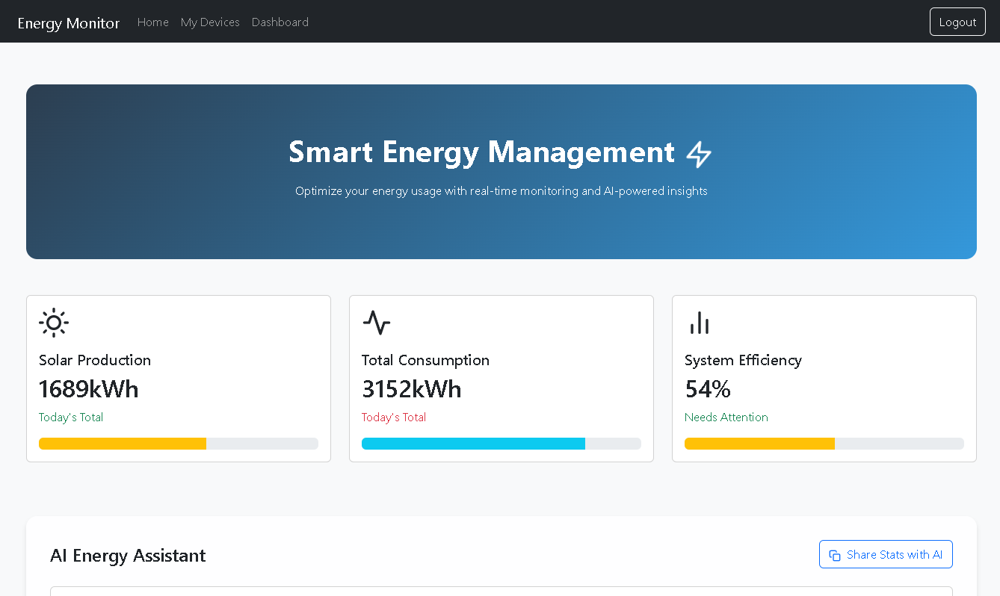
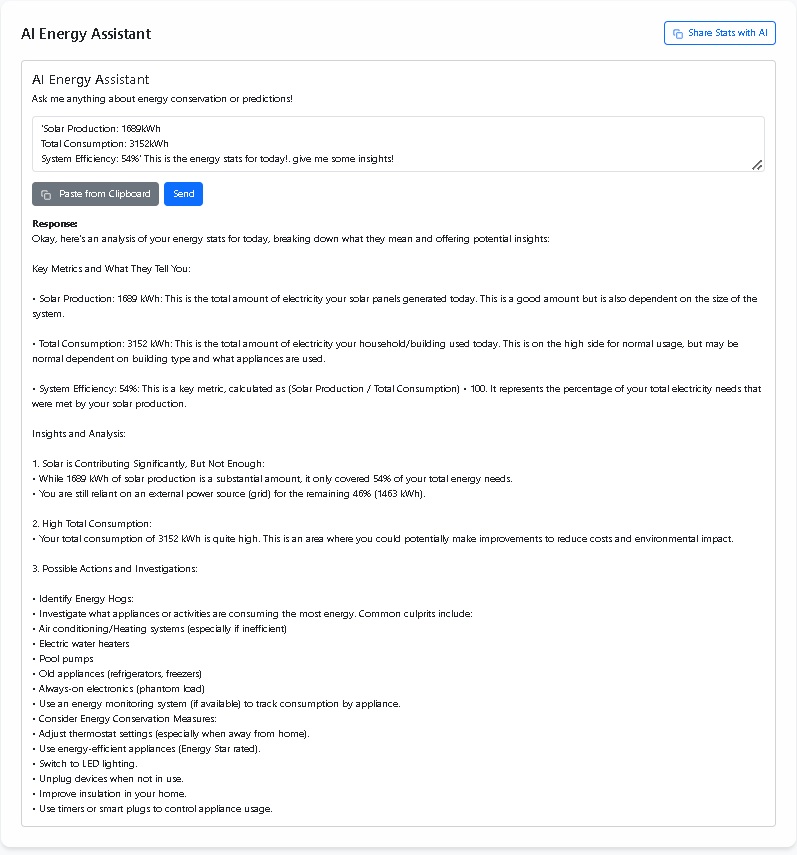

# Smart Energy Management System ⚡

 <!-- Add a screenshot if available -->

A comprehensive energy management application that helps you monitor, analyze, and optimize your energy usage in real-time. Powered by AI insights and interactive visualizations, this system is designed for both residential and commercial energy management.

---

## Features 🌟

### **1. Real-Time Energy Monitoring**
- **Solar Production**: Track energy generated by solar devices.
- **Total Consumption**: Monitor energy consumed by appliances and meters.
- **Net Power**: View the difference between production and consumption.
- **Device-Specific Metrics**: Power, voltage, and current for each device.

### **2. Interactive Dashboard**
- **Dynamic Charts**: Toggle between solar production, consumption, and net power views.
- **System Summary**: Total production, consumption, and efficiency at a glance.
- **Device Cards**: Color-coded cards (green for solar, red for non-solar) with real-time data.

### **3. AI-Powered Energy Assistant 🌟**
- **Personalized Insights**: Ask questions about your energy usage and get AI-generated recommendations.
- **Data Sharing**: Copy energy stats and share them with the AI for analysis.
- **Optimization Tips**: Learn how to improve efficiency and reduce costs.

### **4. Device Management**
- **Add Devices**: Register new devices (solar, meter, or appliance) with name, type, and location.
- **Simulated Data**: Realistic data generation for testing and demonstration.
- **Historical Data**: View time-based trends for individual devices.

### **5. Data Management**
- **Automatic Cleanup**: Old data (older than 24 hours) is automatically deleted.
- **Manual Cropping**: Remove the oldest 10 entries for all devices to manage database size.
- **Data Aggregation**: Calculate averages and totals for system-wide metrics.

### **6. User-Friendly Interface**
- **Responsive Design**: Works seamlessly on desktop and mobile devices.
- **Authentication**: Secure login system with token-based access.
- **Error Handling**: Friendly messages for failed operations and loading states.

---

## Screenshots 📸

### Home Page
 <!-- Add a screenshot if available -->

### Dashboard
 <!-- Add a screenshot if available -->

### AI Assistant
 <!-- Add a screenshot if available -->

---

## Tech Stack 🛠️

### Frontend
- **React.js**: For building the user interface.
- **Chart.js**: For interactive energy charts.
- **Axios**: For API communication.

### Backend
- **Node.js**: For server-side logic.
- **Express.js**: For RESTful API endpoints.
- **MongoDB**: For storing device and energy data.

### AI Integration
- **Gemini API**: For AI-powered energy insights and recommendations.

---

## Installation 🚀

### Prerequisites
- Node.js (v16 or higher)
- MongoDB (v5 or higher)
- Gemini API key (for AI assistant)

### Steps
1. Clone the repository:
   ```bash
   git clone https://github.com/Rohith1905/Smart-Home-Energy-Management.git
   cd Smart-Home-Energy-Management
   ```

2. Install dependencies:
   ```bash
   cd backend && npm install
   cd ..
   cd client && npm install
   ```

3. Set up environment variables:
   Create a `.env` file in the backend/ directory:
   ```env
   MONGO_URI=mongodb://localhost:27017/energyDB
   JWT_SECRET=your_jwt_secret
   OPENAI_API_KEY=your_openai_api_key
   ```

4. Start the server:
   ```bash
   cd backend && npm run dev
   ```

5. Start the client:
   ```bash
   cd client
   npm run dev
   ```

---

## Usage 🖥️

- **Login**: Use your credentials to access the system.
- **Add Devices**: Register your solar panels, meters, and appliances.
- **Monitor Energy**: View real-time data on the dashboard.
- **Analyze Trends**: Use the interactive charts to understand energy patterns.
- **Ask the AI**: Get insights and recommendations from the AI assistant.
- **Manage Data**: Refresh device data or crop old entries as needed.

---

## API Endpoints 🌐

### Authentication
- **POST** `/api/auth/login`: User login.
- **POST** `/api/auth/register`: User registration.

### Devices
- **GET** `/api/devices`: Get all devices for the logged-in user.
- **POST** `/api/devices`: Add a new device.

### Data
- **GET** `/api/data/current`: Get current data for all devices.
- **GET** `/api/data/history`: Get historical data (last 24 hours by default).
- **POST** `/api/data/update-all`: Refresh data for all devices.
- **POST** `/api/data/crop-data`: Delete the oldest 10 entries for all devices.

### AI-Assistant
- **POST** `/api/ai/chat`: To interact with ai assistant.

---

## Contact 📧

For questions or feedback, feel free to reach out:
- **Email**: rohithadiga19@gmail.com
- **GitHub username**: Rohith1905

---

**Made with ❤️ by [Rohith Adiga T R]**
